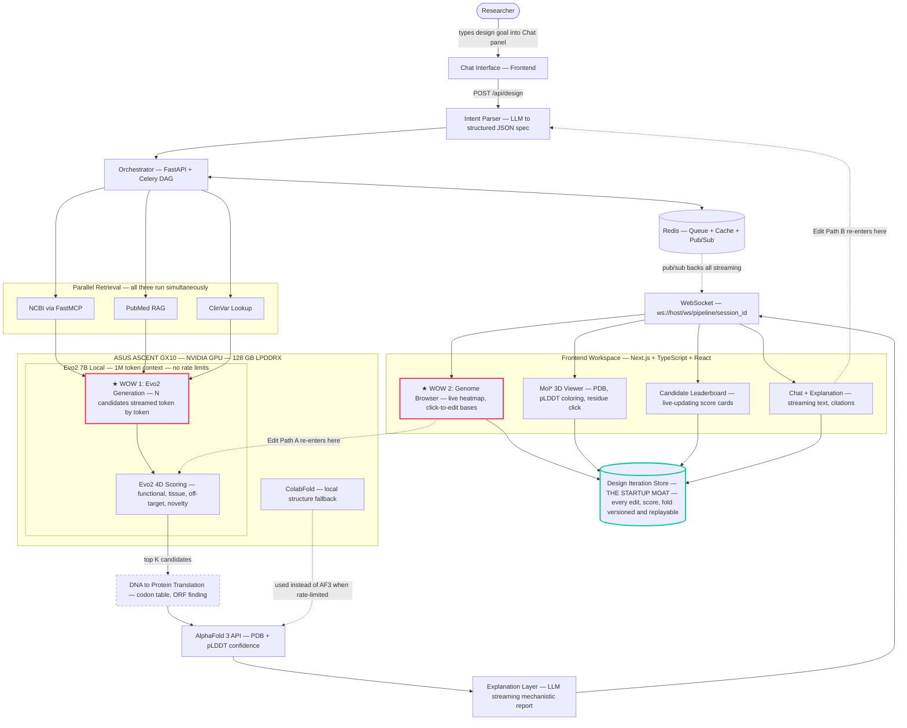
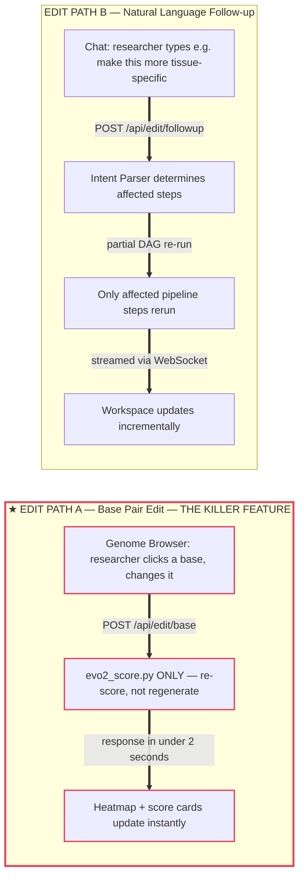
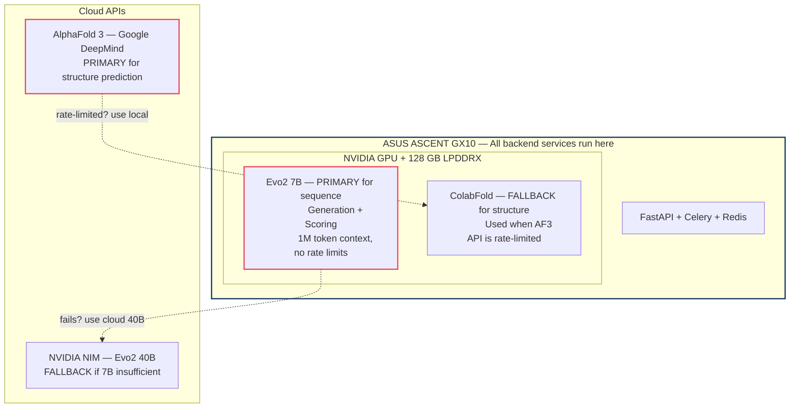

# Helix System Architecture

> **The Cursor for DNA** — a real-time collaborative workspace where researchers and AI co-design genomic sequences, watch the model reason about biology live, and iterate on candidates with full molecular visibility.

This document is the single source of truth for Helix's architecture. Eight views, each answering a different question:

| # | View | Question |
|---|------|----------|
| 1 | [Pipeline Flow](#1-primary-pipeline-generation-mode) | How does data move through the system? |
| 2 | [Edit Paths](#2-interactive-edit-paths) | How does the researcher interact after the pipeline runs? |
| 3 | [Hardware Topology](#3-hardware-and-inference-topology) | What runs where? |
| 4 | [API Surface](#4-api-surface) | What's the contract between frontend and backend? |
| 5 | [Module Ownership](#5-module-ownership) | Who builds what? |
| 6 | [File Map](#6-backend-file-map) | Where does each piece live in code? |
| 7 | [Key Decisions](#7-key-architecture-decisions) | Why these choices? |
| 8 | [Fault Tolerance](#8-fault-tolerance) | What happens when things break? |

---

## 1. Primary Pipeline (Generation Mode)

Data flows **top to bottom**. The researcher types a design goal into the Chat panel. The frontend sends it to the backend via REST. The backend processes it through seven layers. Every step emits events via Redis pub/sub through the WebSocket, so the frontend renders progressively in real time. The frontend workspace sits at the bottom, receiving the stream.

> Note: The Chat panel appears at both the top (sending requests) and the bottom (receiving streamed responses). This is the same UI panel — it both sends the researcher's goal and displays the streaming explanation.



> **Translation step (XLATE):** Runs on CPU, no GPU needed. Converts top-K DNA candidates to amino acid sequences via the standard genetic code before sending to AlphaFold. Pure computation — 20 lines in `services/translation.py`.

**What the researcher sees during a pipeline run:**

| Time | Pipeline Step | Frontend Reaction |
|------|--------------|-------------------|
| 0s | Intent parsed | Structured spec appears in Chat, editable |
| 1-3s | Retrieval completes | Reference genome loads in Genome Browser, variants appear as annotations |
| 3-30s | Evo2 generates candidates | Bases appear one by one in the browser — the model "writing DNA" live |
| 30-45s | Evo2 scores candidates | Confidence heatmap builds under the sequence, leaderboard cards animate in |
| 45-90s | AlphaFold folds top K | 3D protein structures render in Mol*, residues colored by confidence |
| 90-120s | Explanation streams | Plain English report builds in Chat panel with citations |

---

## 2. Interactive Edit Paths

After the pipeline completes, the workspace stays live. Two architecturally separate edit paths:



**Why these are separate code paths:**

| | Path A: Base Edit | Path B: NL Follow-up |
|---|---|---|
| **Trigger** | Click a base in Genome Browser | Type in Chat panel |
| **Backend entry** | `POST /api/edit/base` | `POST /api/edit/followup` |
| **Steps that run** | `evo2_score.py` only | Intent parser → determine affected steps → partial DAG |
| **Latency** | Under 2 seconds | 10-60 seconds depending on scope |
| **Response type** | Synchronous JSON (200) | Async via WebSocket (202 + stream) |

Path A is the killer feature. No other tool gives a researcher real-time AI feedback on manual genomic edits. This is what makes Helix an IDE, not a pipeline.

---

## 3. Hardware and Inference Topology



**Inference routing:**

| Capability | Primary | Fallback | Degrades to |
|-----------|---------|----------|-------------|
| Sequence generation + scoring | Evo2 7B on GX10 | Evo2 40B via NIM API | N/A — core feature |
| Structure prediction | AlphaFold 3 API | ColabFold on GX10 | Return candidates without structure |

**Key advantage:** Local inference means the demo never hits API rate limits. The GX10 is a competitive edge — put it in the pitch.

---

## 4. API Surface

### REST Endpoints

| Method | Path | Purpose | Response |
|--------|------|---------|----------|
| `POST` | `/api/design` | Submit new design goal → full pipeline | `202` + WebSocket URL |
| `POST` | `/api/edit/base` | Single base pair edit → re-score only | `200` + updated scores |
| `POST` | `/api/edit/followup` | NL follow-up → partial pipeline re-run | `202` + stream via WS |
| `POST` | `/api/mutations` | Standalone mutation effect prediction | `200` + delta + impact |
| `POST` | `/api/structure` | Standalone structure prediction | `200` + PDB data |
| `GET` | `/api/health` | Health check | `200` + model status |

### WebSocket Events

Connection: `ws://localhost:8000/ws/pipeline/{session_id}`

```
intent_parsed        → { spec: { target_gene, design_type, ... } }
retrieval_progress   → { source: "ncbi"|"pubmed"|"clinvar", status, result }
generation_token     → { candidate_id, token, position }           ← WOW 1
candidate_scored     → { candidate_id, scores: { functional, tissue, off_target, novelty } }
structure_ready      → { candidate_id, pdb_data, plddt_score }
explanation_chunk    → { text }
pipeline_complete    → { candidates: [...] }
```

### Design Rules

- URLs are nouns. Methods express actions.
- Proper status codes: 200, 202, 400, 404, 422, 500, 503. Never 200 with an error body.
- Stateless. Session state lives in Redis keyed by `session_id`.
- No internal representation leakage. Map model tensors to clean domain types at the boundary.

---

## 5. Module Ownership

| Module | Owner | Description | Status |
|--------|-------|-------------|--------|
| `services/evo2.py` | Vishnu | Evo2 model wrapper — local, NIM API, mock | Built |
| `services/translation.py` | Vishnu | DNA to protein, ORF finding, GC content | Built |
| `pipeline/evo2_score.py` | Vishnu | 4D scoring: functional, tissue, off-target, novelty | Built |
| `cli/evo2_playground.py` | Vishnu | Interactive terminal for manual Evo2 testing | Built |
| `pipeline/intent_parser.py` | Dat | LLM intent decomposition to structured spec | In progress |
| `pipeline/explanation.py` | Dat | LLM mechanistic report generation | Planned |
| `pipeline/retrieval.py` | Vishnu | NCBI MCP + PubMed RAG + ClinVar (parallel) | Planned |
| `services/alphafold.py` | Vishnu | AlphaFold/ColabFold/ESMFold wrapper | Planned |
| `pipeline/structure.py` | Vishnu | Structure prediction pipeline | Planned |
| `pipeline/orchestrator.py` | Vishnu | Celery DAG controller, mode routing | Planned |
| `ws/manager.py` | Vishnu | WebSocket connection manager | Planned |
| `ws/events.py` | Vishnu | Event type definitions | Planned |
| `main.py` | Vishnu | FastAPI app, CORS, WS endpoint | Planned |
| Frontend workspace | Alex | All four panels, streaming, Mol* | In progress |
| Demo script + pitch | Henry | 2-minute demo, judge Q&A prep | In progress |

---

## 6. Backend File Map

```
backend/
├── main.py                    FastAPI app, CORS, WebSocket endpoint
├── config.py                  Pydantic settings, env-driven mode switching
├── celery_app.py              Celery + Redis configuration
├── requirements.txt           Python dependencies
│
├── models/
│   ├── domain.py              Core types: ForwardResult, CandidateScores, Impact
│   ├── requests.py            Pydantic request validation
│   └── responses.py           API response models (matches frontend types)
│
├── services/
│   ├── evo2.py                Evo2Service ABC + Mock + Local + NIM implementations
│   ├── translation.py         Codon table, translate(), find_orfs(), gc_content()
│   ├── alphafold.py           AlphaFold/ColabFold/ESMFold wrapper
│   ├── ncbi_mcp.py            FastMCP server for NCBI queries
│   ├── pubmed_rag.py          Vector store + semantic search
│   └── clinvar.py             ClinVar variant lookup
│
├── pipeline/
│   ├── orchestrator.py        Celery DAG controller, generation vs edit mode routing
│   ├── intent_parser.py       LLM intent decomposition (Dat's module)
│   ├── retrieval.py           Parallel retrieval coordinator
│   ├── evo2_generate.py       Candidate generation with streaming
│   ├── evo2_score.py          4D scoring pipeline
│   ├── structure.py           AlphaFold integration
│   └── explanation.py         LLM mechanistic report (Dat's module)
│
├── ws/
│   ├── manager.py             WebSocket connection manager
│   └── events.py              Event type definitions
│
├── cli/
│   └── evo2_playground.py     Interactive Rich terminal for manual testing
│
└── tests/
    ├── conftest.py            Shared fixtures (mock service, sample sequences)
    ├── test_evo2_service.py   Evo2 service tests (67 tests, all passing)
    ├── test_translation.py    DNA translation tests
    └── test_evo2_score.py     Scoring pipeline tests
```

---

## 7. Key Architecture Decisions

**Hand-rolled DAG, no LangFlow.** Full control over routing, error handling, retry logic, and streaming. LangFlow would create more problems than it solves and undermine credibility with judges who know ML infrastructure.

**Redis serves triple duty.** Job queue for Celery, result cache for intermediate pipeline outputs, and pub/sub channel feeding the WebSocket. One dependency, three roles.

**Two architecturally separate edit paths.** A base pair edit only needs re-scoring (under 2s). A natural language follow-up might need regeneration. These are completely different code paths with different latency profiles. The orchestrator routes based on the entry point, not a flag.

**Local Evo2 inference on the GX10.** No rate limits during demo. 1M token context window. The 7B model fits in 128 GB LPDDRX. The 40B model via NVIDIA NIM API is the fallback, not the primary path.

**ColabFold as AlphaFold fallback.** AlphaFold 3 API has a queue. ColabFold runs locally on the GX10 if rate-limited. If both fail, candidates return without structure data — the frontend handles the empty state. Partial success is success.

**Mock service for parallel development.** The `Evo2MockService` returns deterministic, biologically-informed outputs so the frontend can integrate and the scoring pipeline can be validated before real Evo2 is running on the GX10.

**Streaming is not a gimmick.** Every pipeline step emits events via the WebSocket. The frontend reacts to each event by rendering the next piece of the visualization. This is the actual computation presented progressively — the researcher watches the model think. This is what separates Helix from Callio Labs.

---

## 8. Fault Tolerance

| Failure | Response |
|---------|----------|
| NCBI down | Continue with PubMed RAG + ClinVar only |
| AlphaFold rate-limited | Fall back to ColabFold local |
| ColabFold also fails | Return candidates without structure data |
| Evo2 forward pass timeout (30s) | Return 503 with Retry-After |
| GPU busy | Return 503 with Retry-After |

**Partial success is success.** Degrade gracefully, never crash the pipeline.
