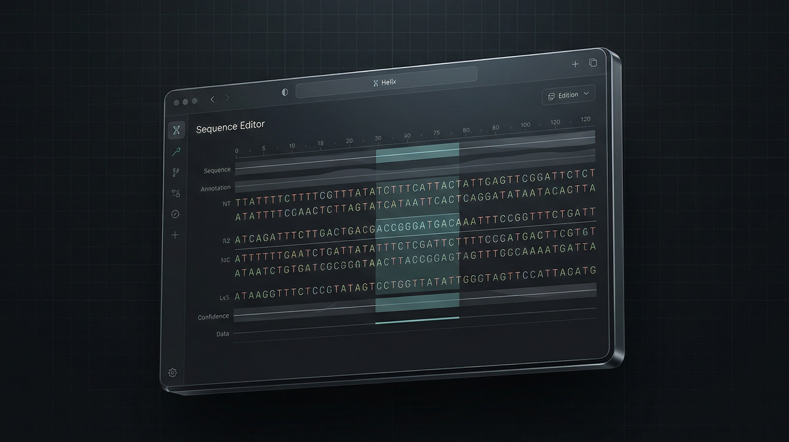
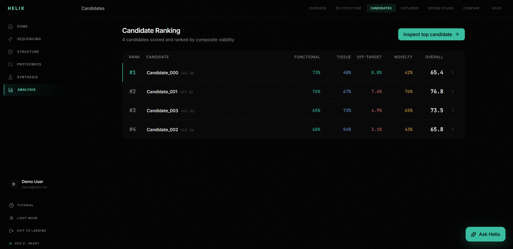

<div align="center">
  

  # Helix

  **Cursor for genomic design — from prompt to editable DNA workspace in real time.**

  [](https://nextjs.org/)
  [](https://react.dev/)
  [](https://fastapi.tiangolo.com/)
  [](https://redis.io/)

  [Architecture](ARCHITECTURE.md) · [Source of Truth](SOURCE_OF_TRUTH.md) · [Report Bug](https://github.com/Dawgsrlife/Helix/issues)
</div>

---

## 🎬 Demo

<div align="center">
  
  <p><em>Design candidates, stream scoring, inspect folds, and iterate with an agentic copilot.</em></p>
</div>

---

## ✨ Overview

Helix is an **AI-native genomic design IDE** for fast, transparent iteration.

You describe a goal in plain language, Helix generates and scores multiple DNA candidates, visualizes structure, and lets you edit bases with immediate feedback.

> *"Type a design objective, then co-edit sequence with AI in one workspace."*

<div align="center">
  
</div>

### Features

| Feature | Description |
|---------|-------------|
| 🧠 **Agentic Copilot** | LangGraph-powered side agent that plans, executes tools, reflects, and responds with rationale. |
| ⚡ **Live Pipeline Streaming** | Intent, retrieval, generation, scoring, structure, and explanation stream via WebSocket in real time. |
| 🧬 **Editable Genome Workspace** | Click any base, mutate instantly, and get rapid re-scoring with updated heatmaps. |
| 🧪 **Multi-Candidate Ranking** | Generate up to 10 candidates, compare across functional/tissue/off-target/novelty dimensions. |
| 🧱 **3D Fold Studio** | Interactive 3D protein view with confidence coloring and residue inspection. |
| 📚 **Context-Aware Retrieval** | NCBI, PubMed, and ClinVar retrieval enriches design context before generation. |
| 🧭 **Layman Guidance** | Guided suggestions and plain-language explanations designed for non-expert demos while retaining researcher detail. |

---

## 📸 Gallery

<div align="center" style="display: grid; grid-template-columns: 1fr 1fr; gap: 10px;">
  
  
  
  
</div>

---

## 🚀 Setup & Deployment

### Quick Start (Local)

1. **Clone**
   ```bash
   git clone https://github.com/Dawgsrlife/Helix.git
   cd Helix
   ```

2. **Backend**
   ```bash
   cd backend
   python -m venv .venv
   source .venv/bin/activate
   pip install -r requirements.txt
   cp .env.example .env
   ```

3. **Run Redis + API**
   ```bash
   redis-server
   # new terminal:
   cd backend
   source .venv/bin/activate
   uvicorn main:app --reload --port 8000
   ```

4. **Frontend**
   ```bash
   cd frontend
   npm install
   cp .env.example .env.local
   npm run dev
   ```

5. **Open**
   - App: [http://localhost:3000/analyze](http://localhost:3000/analyze)
   - API health: [http://localhost:8000/api/health](http://localhost:8000/api/health)

### Docker (Recommended)

```bash
docker compose up --build
```

- Frontend: [http://localhost:3000](http://localhost:3000)
- Backend: [http://localhost:8000](http://localhost:8000)

---

## 🛠️ Architecture

Helix uses a streaming, event-driven architecture:

```text
Prompt -> Intent Parse -> Retrieval (NCBI/PubMed/ClinVar) -> Evo2 Generation
      -> Candidate Scoring -> Structure Prediction -> Explanation -> Editable Workspace
```

- **Frontend:** Next.js 16, React 19, Zustand, Framer Motion.
- **Backend:** FastAPI, Pydantic, Redis-backed session + event flow.
- **AI stack:** Evo2 (mock/local/NIM modes), ESMFold/mock structure, LangGraph copilot.
- **Transport:** REST for control + WebSocket for progressive streaming.

See:
- [ARCHITECTURE.md](ARCHITECTURE.md)
- [BACKEND_ARCHITECTURE.md](BACKEND_ARCHITECTURE.md)
- [SOURCE_OF_TRUTH.md](SOURCE_OF_TRUTH.md)

---

## 🧪 Testing

```bash
cd backend
source .venv/bin/activate
pytest -q
```

```bash
cd frontend
npm run build
```

---

## 🧭 Project Structure

```text
Helix/
├── backend/
│   ├── main.py
│   ├── pipeline/
│   ├── services/
│   ├── ws/
│   └── tests/
├── frontend/
│   ├── app/
│   ├── components/
│   ├── hooks/
│   ├── lib/
│   └── public/
├── docker-compose.yml
├── ARCHITECTURE.md
├── BACKEND_ARCHITECTURE.md
└── SOURCE_OF_TRUTH.md
```

---

## ⚠️ Research Use Note

Helix is a research/demo platform and not a clinical decision system. Treat outputs as hypotheses requiring domain review and experimental validation.

---

## 🤝 Contributing

Contributions are welcome.

1. Fork the repository
2. Create a feature branch
3. Ensure tests/build pass
4. Open a pull request

---

<div align="center">
  <sub>Built by Team Helix · YHack 2026</sub>
</div>
